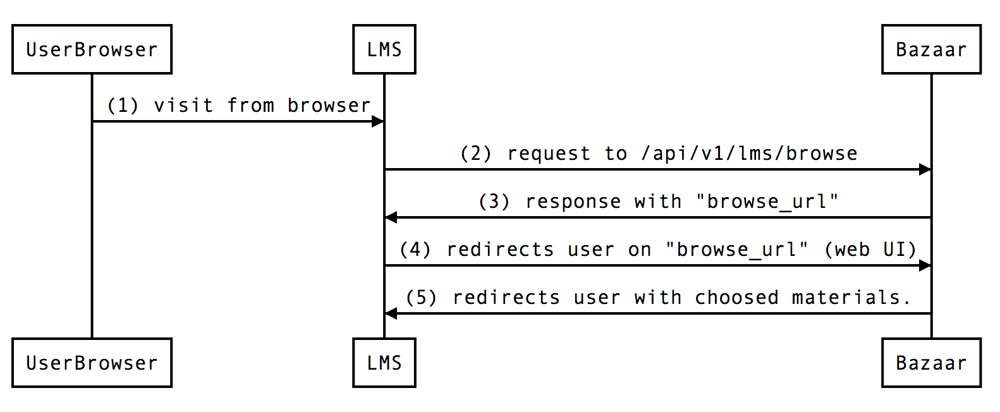
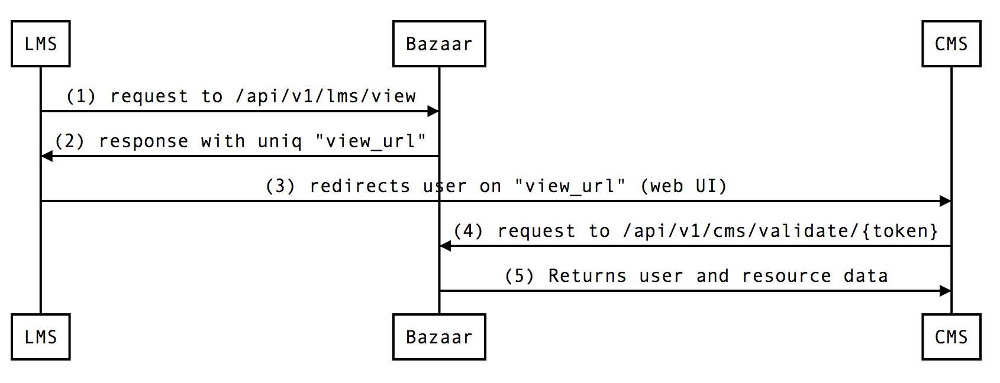

# Getting started

## 1. Register your application

  Contact EduCloud (educloud@example.com) for review of your application or service. We'll require the following information:
  
  - Company or developer name and contact information
  - Name of application or service
  - Description of application or service
  - Application URL (format: https://www.example.com)
  - OAuth Redirect URL (format: https://www.example.com/aouth/callback or 'urn:ietf:wg:oauth:2.0:oob')
  
  After a successful review, we'll provide you with the following:
  
  - Application name
  - Client ID
  - Client secret
  - Authorization server endpoints
  - Web services API endpoint
  
  Application Name, Client ID and Client secret are application specific and must only be used with your application or service.

## 2. Authorization

There are currently one way to authorization through EduCloud API v1.

By [client credentials](https://tools.ietf.org/html/rfc6819#section-4.4.4).

In ruby, it would be something like this:
~~~~
client_id = '4ea1b...'
client_secret = 'a2982...'

response = RestClient.post 'https://educloudalliance.apinf.io/oauth/token', {
  grant_type: 'client_credentials',
  client_id: client_id,
  client_secret: client_secret
}

token = JSON.parse(response)["access_token"]
# => 'a2982...'
~~~~

## 3. Authentication 

There are two ways to authenticate through EduCloud API v1.

OAuth2 Token (sent in a header or as a parameter)

~~~~
$ curl -H "Authorization: Bearer OAUTH-TOKEN" https://educloud.samposoftware.com/api/v1/
~~~~

Read more [about OAuth2](http://oauth.net/2/).

## 4. API documentation

Check the latest [API documentation](https://educloudalliance.apinf.io). 

# LMS workflow

## Choose material

1. User visit LMS site and make login by MPASS.fi.
2. User click browser. LMS makes a POST request to the Bazaar with arguments from MPASS.fi.
3. Bazaar replies with unique browse_URL with 'session_id' for login.
4. LMS redirects user to the Bazaar store (WEB UI).
5. User choose materials and redirects back to LMS with materials data. 

## View material

1. LMS makes a POST request to the Bazaar with arguments for api/v1/lms/view.
2. Bazaar replies with unique url.
3. LMS forwards user to the unique url (CMS).
4. CMS make request to Bazaar for validate user token.
4. Bazaar response with user data from the Bazaar using token.
